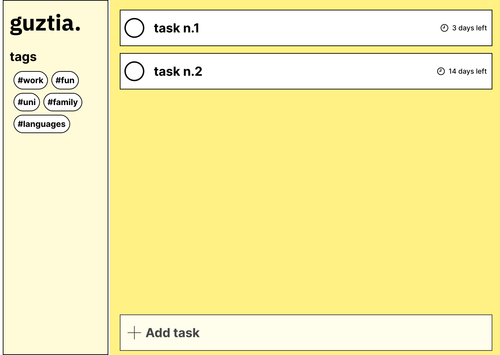
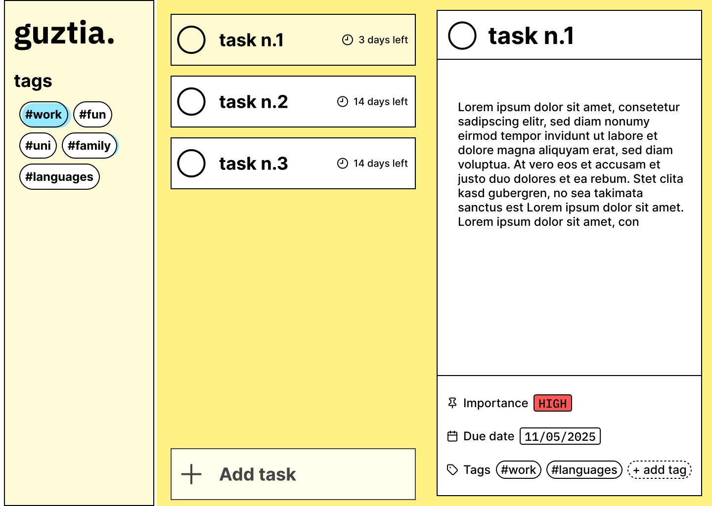

# Todo list

This is the fourth project of the JavaScript Course from the curriculum of [The Odin Project](https://www.theodinproject.com/lessons/node-path-javascript-todo-list).
It will serve as a practice for using JavaScript (Objects, Factories/Classes, Modules, JSON) as well as improving my Webpack scripts,and learn a bit about localStorage. I will also try to have in mind the most important OOP Principles.

## Visual design

For the interface, I went with the Neubrutalist aesthetic. The layout was heavily inspired by Microsoft To Do, the todo app I currently use.

